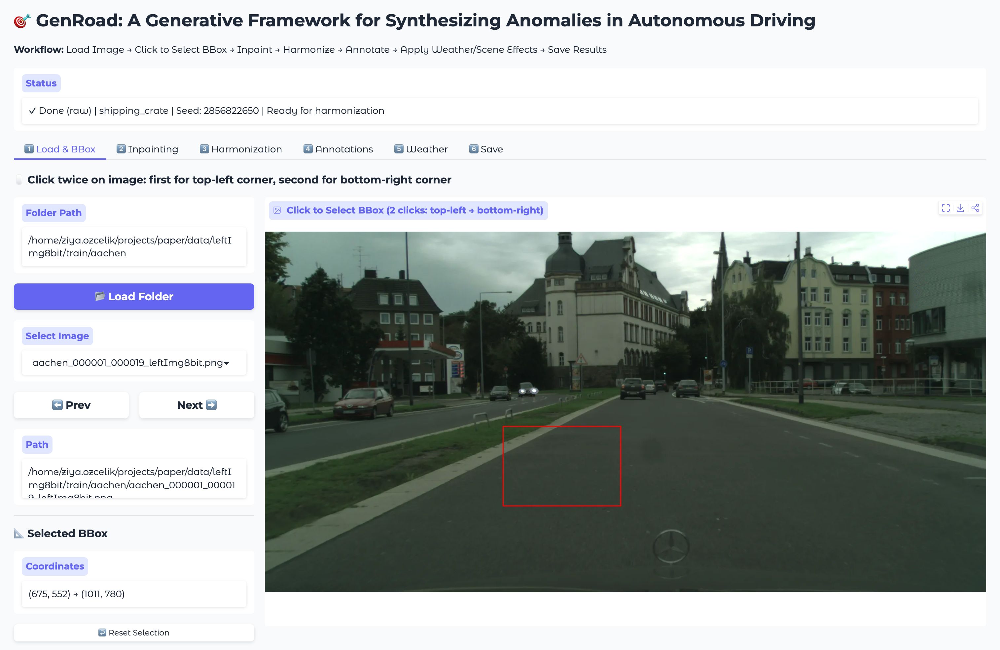
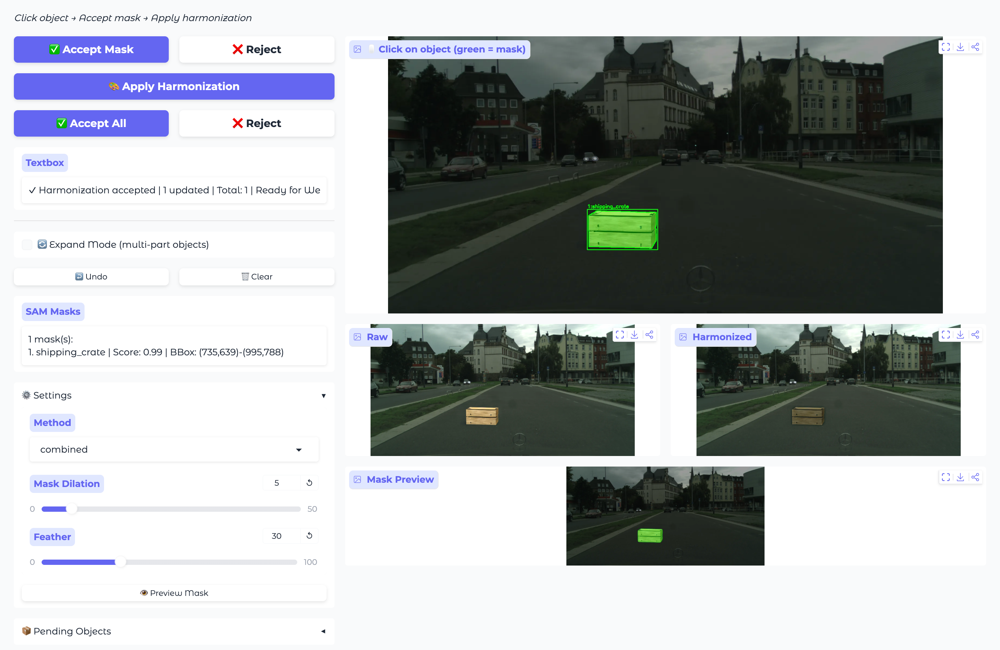
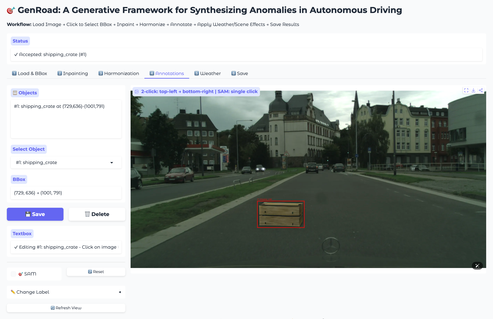
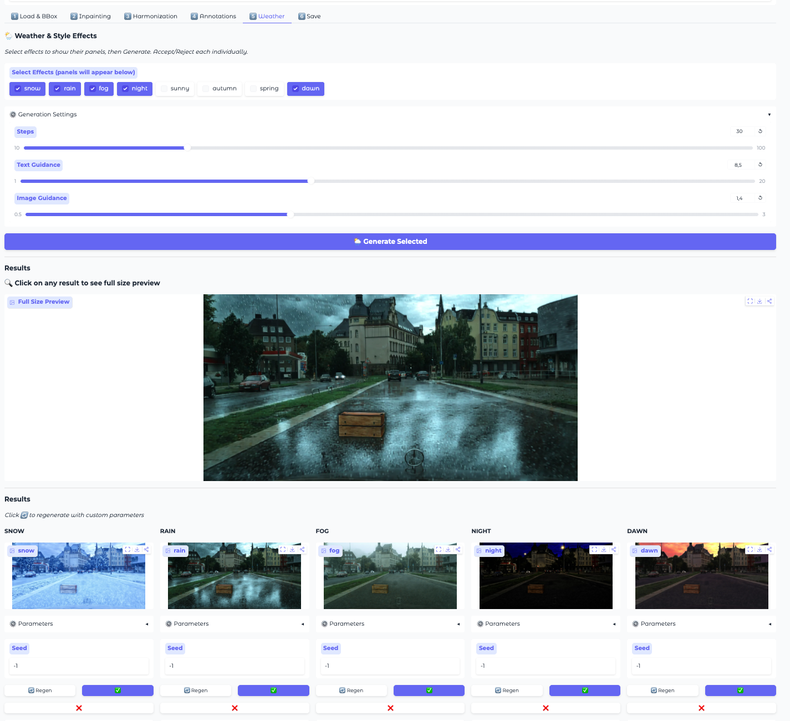
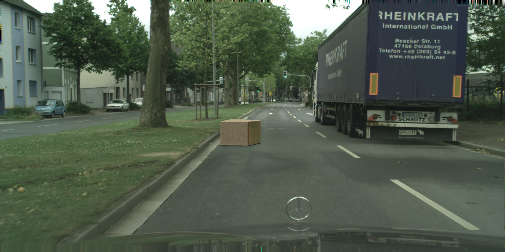
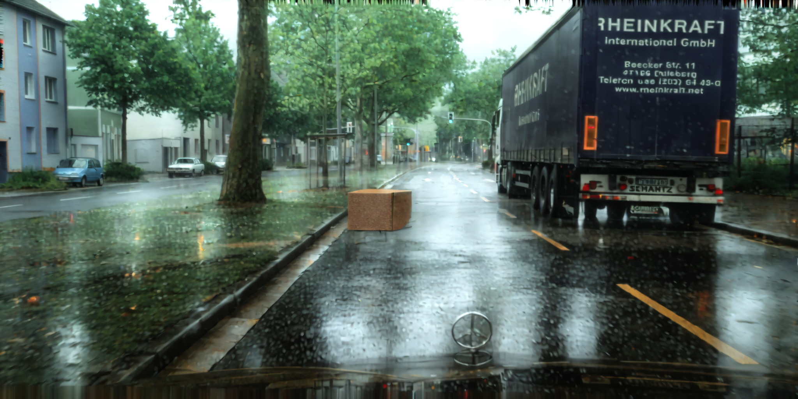
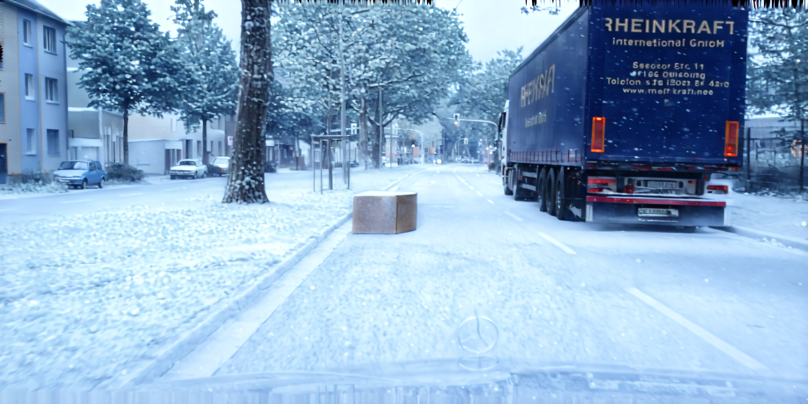
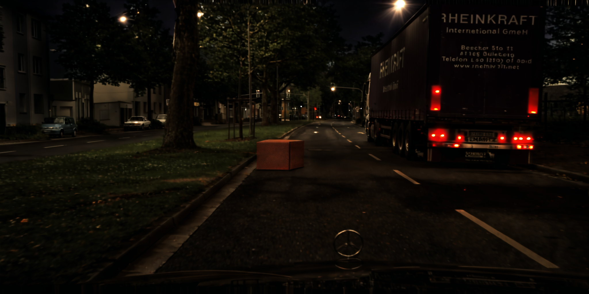
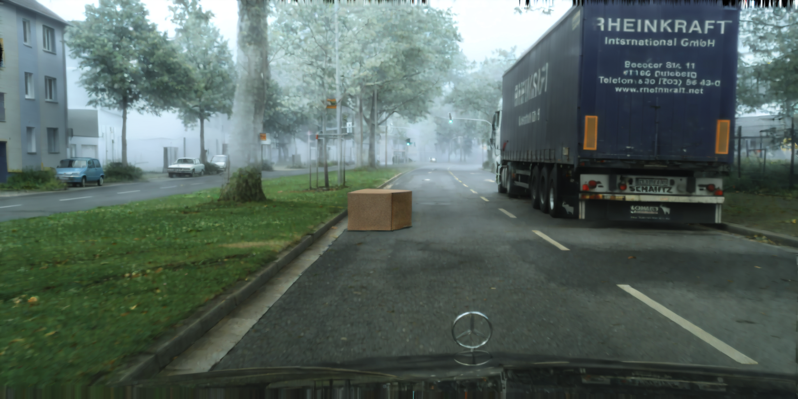
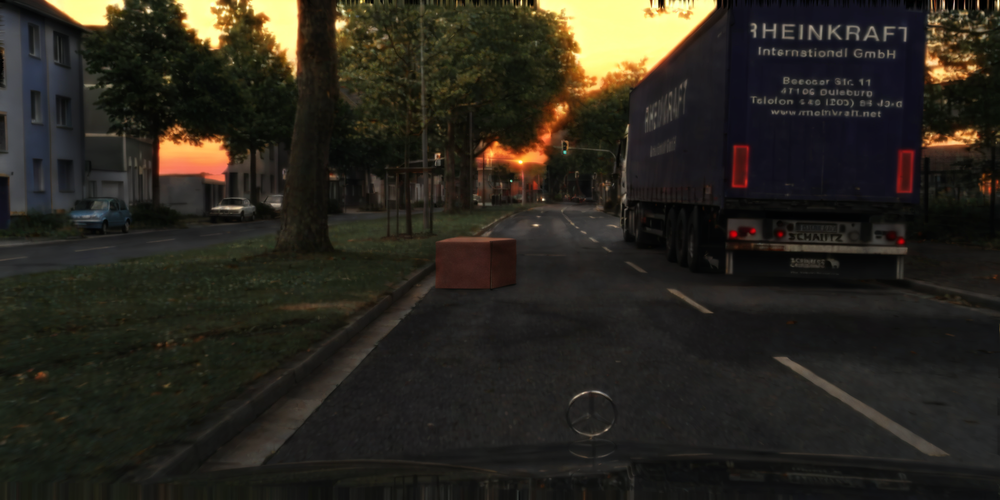

# GenRoad: A Generative Framework for Synthesizing Anomalies in Autonomous Driving

GenRoad is a modular, human-in-the-loop framework designed to transform standard autonomous driving images into complex "corner case" scenarios. It enables the injection of 17 different road anomalies into high-resolution scenes and adapts these scenes into 5 diverse environmental conditions (Rain, Snow, Fog, Night, Dawn).

## 🌟 Overview

This repository contains the **GenRoad Dataset** and the visual documentation of the GenRoad framework. The framework bridges the gap between common urban driving data and the "long-tail" distribution of hazardous corner cases by integrating:

- **Latent Diffusion Models (LDMs)** for high-fidelity object inpainting.
- **Segment Anything Model (SAM)** for precise semantic masking.
- **CosXL Edit** for global environmental scene adaptation.

---

## 🖥 Interactive Demo Interface

The GenRoad framework features an interactive Gradio-based web interface that allows users to generate custom anomalies.

---

## 📊 The GenRoad Dataset

The dataset provides 1,700 high-resolution images ($2048 \times 1024$) based on the Cityscapes architecture, designed to benchmark and improve the robustness of perception models.

### Dataset Composition
- **Total Samples:** 1,700 images.
- **Anomaly Categories:** 17 (e.g., Rock, Stroller, Fallen Tree, Shipping Crate, Tire).
- **Environmental Styles:** Inpainted (Clear), Snow, Rain, Fog, Night, Dawn.
- **Annotations:** Full JSON metadata including bounding boxes, class labels, and weather styles.

## 🖼 Dataset Samples

Click on the images to view them in full resolution.

| | | |
|:---:|:---:|:---:|
|  |  |  |
| **Inpainted** | **Rain** | **Snow** |
|  |  |  |
| **Night** | **Fog** | **Dawn** |

## 📥 Download Dataset

The GenRoad dataset is provided in three parts for ease of download. Please download all parts and extract them into the same directory to maintain the folder structure.

| Part | Download Link | Size |
| :--- | :--- | :--- |
| **Part 1** | [Download part1.zip](https://github.com/sahibinden/GenRoad/raw/refs/heads/main/GenRoad_dataset/part1.zip?download=) | 1.98 GB |
| **Part 2** | [Download part2.zip](https://github.com/sahibinden/GenRoad/raw/refs/heads/main/GenRoad_dataset/part2.zip?download=) | 1.01 GB |
| **Part 3** | [Download part3.zip](https://github.com/sahibinden/GenRoad/raw/refs/heads/main/GenRoad_dataset/part3.zip?download=) | 1.58 GB |

---

## 📈 Benchmark Results

Our experiments with state-of-the-art open-vocabulary detectors show that GenRoad-generated data significantly enhances detection performance:

| Model | Zero-Shot mAP@50 | Fine-Tuned (GenRoad) | Improvement |
| :--- | :---: | :---: | :---: |
| **YOLO-World** | 0.2697 | **0.9043** | **+235.4%** |
| **OWL-ViT** | 0.2347 | 0.7268 | +209.7% |
| **GroundingDINO**| 0.3193 | 0.3454 | +8.2% |

>[!NOTE]  
>**🚀 Codebase & Dataset Release:** The source code for the online demo and the dataset will be uploaded soon. **Stay tuned for the update!**
